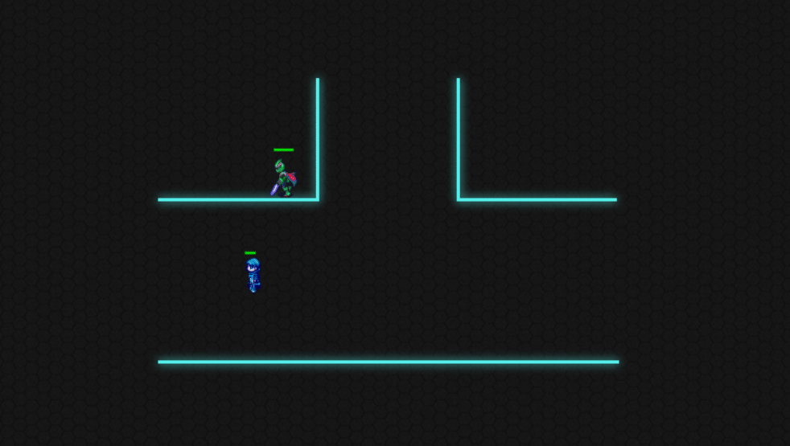

# Aura


[Aura](https://aidanskye42.github.io/Aura/) is a simple arcade-style shooter game initially built from scratch in 5 days. The objective of the game is to kill all of the enemies on every level without dying yourself. There are currently 6 levels built to showcase functionality, but more can be added very easily.

- Arrow keys move
- WASD fires a blaster
- P pauses the game
- ENTER is used to begin/retry levels.

## Technologies Leveraged

- Application is built entirely out of Vanilla JS and Canvas, making heavy use of ES6 classes.
- Yes, everything you see is done purely with one canvas.
- Webpack to bundle everything together

## Feature Highlights



1. Different AI behaviors - There are currently three enemies to showcase three AI options
    - Normal Enemy AI (the Robots) - These enemies head straight for you, without regard for walls. It is easy to get them caught on walls, and they follow predictable behavior, but in large quantities they can prove difficult.
    - Smart Enemy AI (Knights) - these enemies will attempt to find the shortest path to you if you are nearby, navigating around walls. With a very slight adjustment, they can also attempt to avoid bullets and dangerous obstacles, but this quickly became unfair. If you are not nearby, or they cannot find a short path to you, they will default to just heading straight for you like the robots. Their AI is a simple BFS of possible moves at every location.
    - Random AI (the Slimes) - These enemies are not meant to be intelligent, they just move randomly every so often, without any regard for walls or what they may run into. Although not particularly useful on their own, a large horde of them can make fighting knights much more difficult.

2. Obstacles
    - The standard blue barriers everywhere! You cannot pass through them at all. There are also four bordering the frame. Bullets also are absorbed by them. The middle ones even have a very subtle animated glow!
    - Lasers - These do damage to you if you stand on them or walk through them. While you can walk and shoot through them, so can enemies. They can even be used as an environmental hazard to dispose of enemies if you want to play without shooting anyone.
    - Alternating lasers - These alternate on and off every so often, and can be set to alternating cycles so some turn on when the others turn off!
    - Enemies themselves - You cannot walk through an enemy, and if you are being attacked by one, you won't be able to move.

3. Modular Design

    
    - Application keeps track of current state, to easily allow rendering different screens every frame.
    - Current frame computed off delta from previous frame and computations are scaled accordingly, so it should stay consistent even if your frame rate dips!
    - Adding a new enemy, obstacle, or level is as easy as changing a few variables. Most of the game configuration is handled via a constants file as well, so it is easy to tweak gameplay. Aura can function as an entire game engine for a different game via just replacing the sprites and changing a few easily configurable values.

### Creating a new level is very simple!
 - First, define a layout:
```JS
//This is a silly example layout, but it shows how easy it is to build a new map: just add obstacles, and give them positions and height/width.
const exampleLayout = ()=>([
  verticalWall({
    position: [570, 197],
    height: 111
  }),
  horizontalWall({
    position: [424, 308],
    width: 149
  }),
  verticalAlternatingLaser({
    position: [849, 308],
    height: 153,
    parity: 1 //0 or 1, depending on if it should start enabled or disabled
  }),
  horizontalLaser({
    position: [570, 197],
    width: 130
  })
]);
```
  - Define any enemies you want
```JS
//Enemies take a few more parameters to construct, but the generator function should only take in a position, so you can easily place them after it is defined
const slime = (position) => new DumbEnemy({ //Can be DumbEnemy (random movement), Enemy(runs straight at you), SmartEnemy(attempts to find the shortest path)
  position,
  velocity: [0, 0],
  width: 36,
  height: 42,
  grace: [[5, 5], [6, 2]], //how much grace on each side should the hitbox before collision is detected
  hp: 20,
  image: IMAGES.ENEMIES.SLIME,
  moveSpeed: 0.6 * MOVE_SPEED
});
```
  - And then add it to the levels array
```JS
//Adding a new level is as simple as picking a layout and placing enemies
const LEVELS = () => [
  //...
  {
    player: centeredPlayer(), //Places the player in the center
    obstacles: exampleLayout(), //The example layout we just made!
    enemies: [
      slime([100,100]), //Adds a prebuilt enemy, just give it an [x,y] location
      slime([1100, 100]),
      slime([100, 600]),
      slime([1100, 600])
    ]
  },
  //...
];
```

## Possible Future Plans

- More enemies
- More levels
- More obstacles
- Powerups
- Score tracking
- Sound effects (mutable, of course!)
